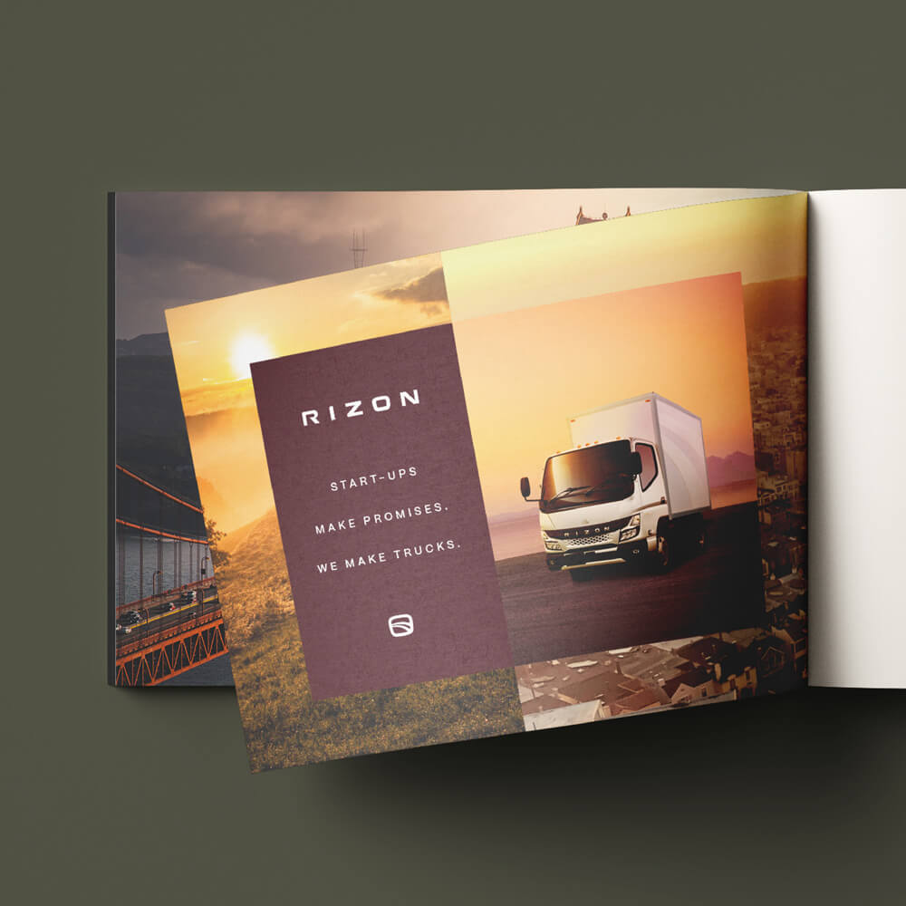
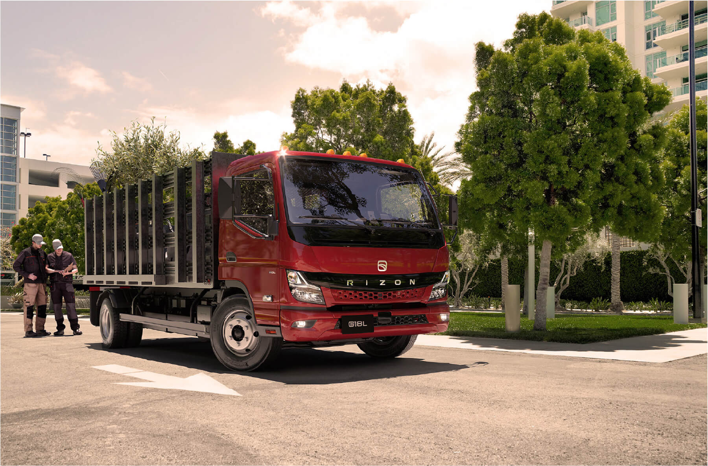

# RIZON
Original website: https://www.rizontruck.com
Awwwards: https://www.awwwards.com/sites/rizon-driving-green-innovation
-----------------------------------------------------
Challenges faced:
- text formatting (overall problems with the text placement and division)
- finding the adequate font (couldn't find website's original font)
- using less 
 
- formatting images (problems with image placement and proper resizing)
- avoiding useless code in CSS
- setting up the flexbox
-----------------------------------------------------
Solutions: 
- putting text elements in a text container:

   <figure class="text-container">
        <h1>RIZON│Electric Medium Duty</h1>
        <h3>
            RIZON Truck. Bringing  
            calm to the chaos.
        </h3>
        

            The brand that will make your transition to electric successful. Our trucks   
            and services are built from REAL industry experience.
        

    </figure>
    
- using a font that I consider the best, straying a bit from the original design:
  font-family: 'Franklin Gothic Medium', 'Arial Narrow', Arial, sans-serif;

- using semantic elements instead of 
:

  <header>
    <nav class="navbar">
        
        <menu class="nav-links">
            <li><a href="#">Products & Services</a></li>
            <li><a href="#">About</a></li>
            <li><a href="#">Contact</a></li>
            <li><a href="#">Press & Events</a></li>
            <li><a href="#">Rizon Journal</a></li>
        </menu>
        <figure class="location">
            <a href="#">Find a dealer</a>
        </figure>
    </nav>
</header>

- putting images in an image container:

    <figure class="image-container2">
        
        
        
    </figure>
    
- Validating my code
- watching Flexbox tutorials and looking for sources explaining it (still in progress)
-----------------------------------------------------
Summary:
Overall I am satisfied with my performance, I made pretty decent progress. I did meet specific challenges, but I solved most of them. Lastly, I look forward to continuing to improve my skills and knowledge.
Wit Zakrzewski
